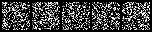
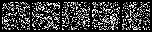

# nanoDDPM
[中文](https://github.com/charles214chen/nanoDiffusion/blob/main/README_cn.md)
>Train a tiny diffusion model even with CPU. Implemented with Pytorch.
> Tiny **U-net** style model and **mnist** dataset using only label `0` and `1` 
---
[TOC]
## Prepare
1. python3.8
2. pip install -r requirements.txt

## Eval
<u>Pretrained model</u> trained with 20000 iterations. More iterations should be better. Strongly recommend you try it.

```shell
bash eval.sh
```

**visualize the generation**
<p align="center">

</p>

<p align="center">

</p>

## Train
```shell
bash train.sh
```
Feel free to tune the training arguments as you want. Have fun!

Welcome to pull request.