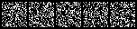

## nanoDiffusion

---
diffusion模型原理学习 & 实践 & 玩具库

## 目的
- 用以学习与实践，若你刚接触diffusion并打算开始实践，从这开始是一个好的选择

-  与原库相比，本项目特点:
    1. 微重构，提升了可读性与可扩展性
    2. 去除多余代码，尽量做到"极小"的代码量，而不失算法原理重要步骤
    3. 提供训练脚本让大家能在消费级GPU或者CPU完成训练；并可视化成果

## 开始
- 环境
  - python3.8
  - pip install -r requirements.txt


- Train : 极小模型生成手写数字0和1（带条件）；数据集会自动下载，模型文件将存放于scripts/checkpoints/
```shell
python scripts/train_tiny_mnist.py
```

- Eval : 评估，-v即产出生成过程视频
```shell
python scripts/sample_images.py --model_path "your model file path" -v
```

- Visualize : eval步骤中的结果
  - here are the sampling process with model training after 2400 iterations.
  - More iterations should be better. Strongly recommend you try it.

  

  <p align="center">
    
  </p>
