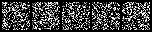

## nanoDiffusion
> diffusion模型原理学习 & 实践 & 玩具库
---
<p align="center">

</p>

<p align="center">

</p>

[TOC]
## 目的
- 用以学习与实践，若你刚接触diffusion并打算开始实践，从这开始是一个好的选择
- 对原库进行了若干为重构，重点提升可读性
- 去除多余代码，尽量做到"极小"的代码量，而不失算法原理重要步骤
- 提供训练脚本让大家能在消费级GPU或者CPU完成训练；并可视化成果

## 快速开始
### 环境准备
- python3.8
- pip install -r requirements.txt
    
### 评估
使用预训练模型, 20000 iterations. 生成结果保存至`eval_out`
```shell
bash eval.sh
```

### 训练
极小模型生成手写数字0和1（带条件）；数据集会自动下载
```shell
bash train.sh
```

## 写在最后
- 希望能对你有所帮助
- 欢迎贡献！

